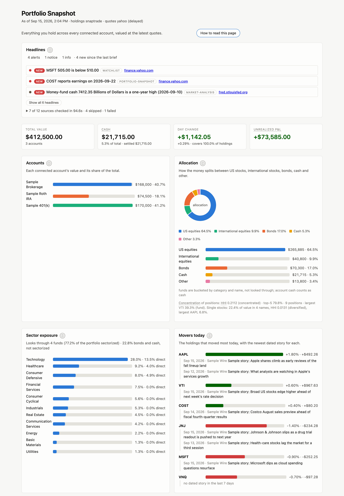
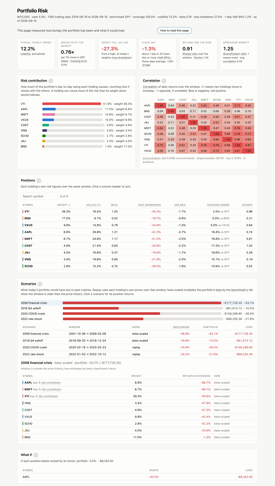
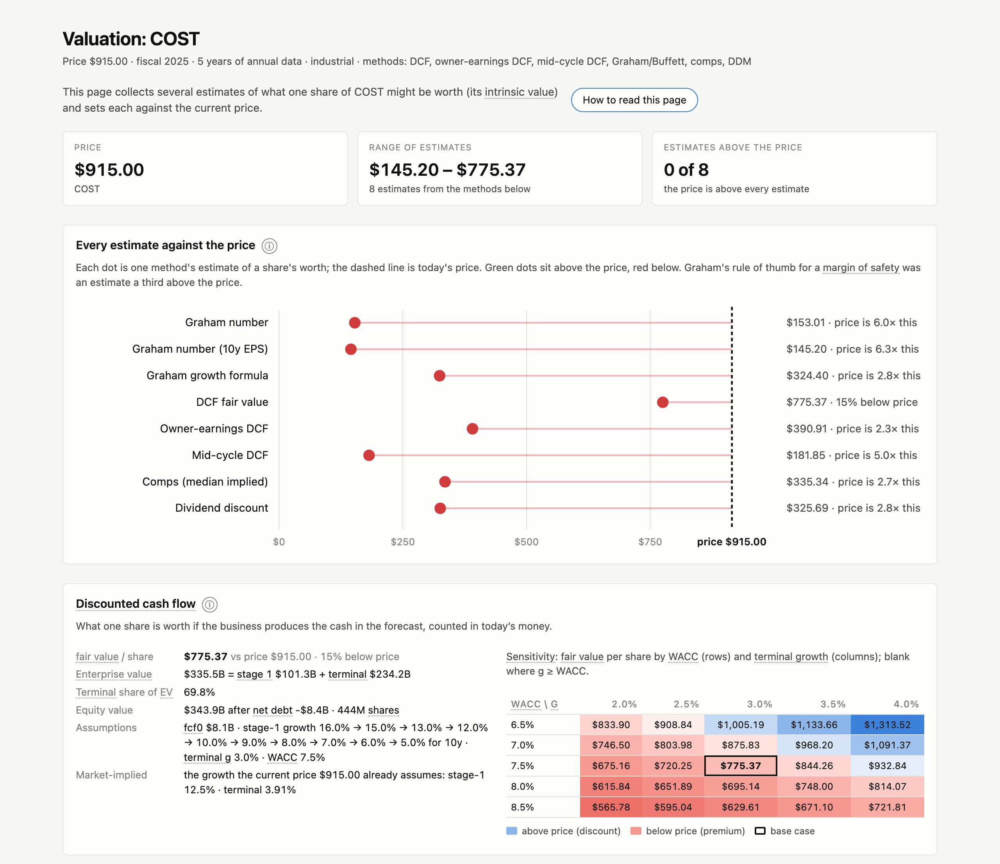
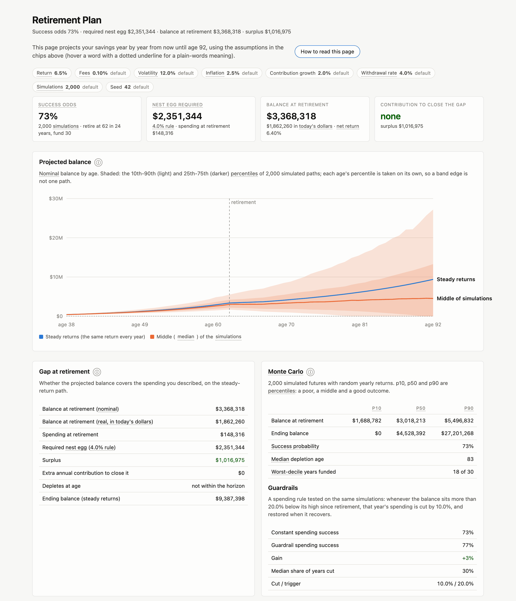
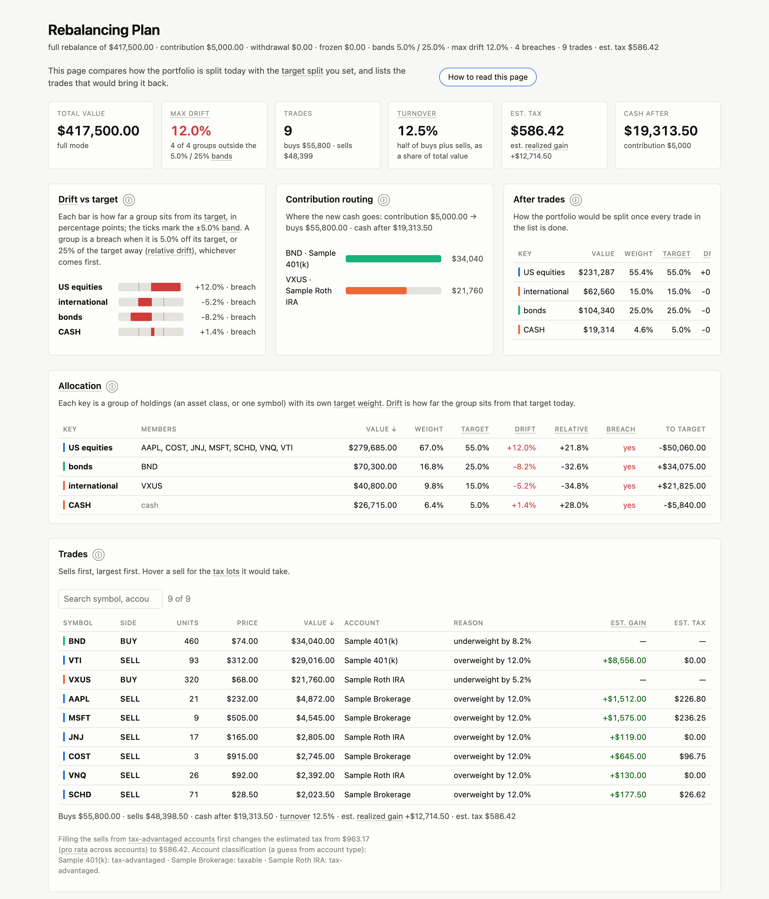
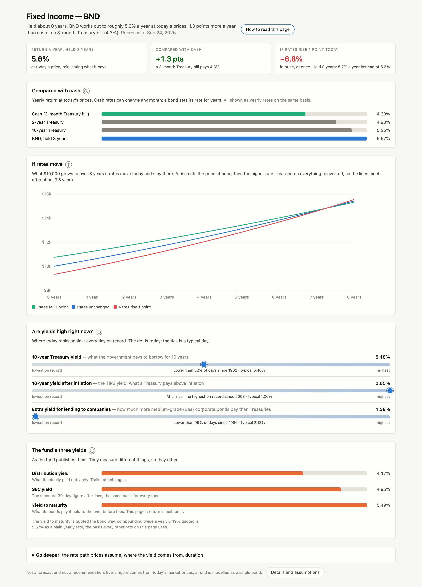
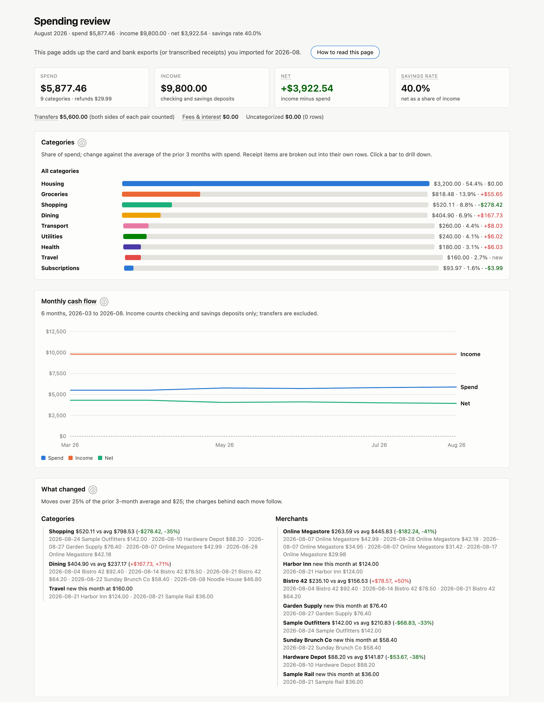

# Second Opinion - Finance

**A principled second opinion on every money decision.**

[](LICENSE)
[](https://github.com/bshurick/second-opinion/actions/workflows/ci.yml)
[](https://claude.com/claude-code)

Second Opinion is a Claude Code plugin for your own finances. It reads the brokerage accounts you connect and the statements and exports you give it, and works through questions about your portfolio, taxes, debt, home, and retirement together. The calculations are done by Python scripts bundled with the plugin rather than by the model, and your keys and records stay in files on your machine; this project runs no server and has no account of its own. It is built to analyze, not to advise: the skills are written to lay out the numbers, the cases for and against, and the risks, and not to say buy, sell, or hold.



- "How is my portfolio doing today?"
- "What happens to my portfolio if 2008 repeats?"
- "What's a fair price for COST?"
- "I'm 38 with $400k saved. Am I on track to retire at 60?"
- "I'm moving. Run the numbers on selling my condo versus renting it out: cap rate, cash flow, IRR over ten years."
- "Buy 10 shares of VTI in my E*Trade account." Claude previews the order, and nothing is sent until you say yes and approve the command.

```
/plugin marketplace add bshurick/second-opinion
/plugin install second-opinion@second-opinion
/reload-plugins
```

Then say **"get started with Second Opinion"**.

> This is an independent open-source project by an individual. It is not affiliated with, endorsed by, or supported by Anthropic, SnapTrade, E*Trade, Yahoo, the SEC, the Federal Reserve Bank of St. Louis, or any brokerage. Nothing here is financial, tax, or legal advice; see [Safety and disclaimer](#safety-and-disclaimer).

## Install

**Requirements:** [Claude Code](https://claude.com/claude-code), Python 3.10+ on your PATH, and Node.js 20+ to run the installer (`node --version`). A brokerage key is optional: the research, planning, and learning skills need none. For your own accounts you need a free SnapTrade Personal API key, which means creating a SnapTrade account, or an E*Trade developer key ([how to get one](docs/connecting-brokerages.md)).

### From the plugin marketplace

In Claude Code:

```
/plugin marketplace add bshurick/second-opinion
/plugin install second-opinion@second-opinion
```

Every skill is installed, including the two extra skills; the pre-buy check and suggested follow-up questions stay off until you turn them on. The Python virtualenv is built by the plugin's session-start hook the first time a session starts. Changes apply after `/reload-plugins` or in a new session.

To add brokerage keys or turn on optional extras, run the installer from a terminal. It detects the marketplace install and only writes settings, never plugin files:

```bash
node ~/.claude/plugins/marketplaces/second-opinion/install.js
```

Or say "set up Second Opinion" in Claude. The `setup` skill turns extras on or off for you, rebuilds dependencies, and reports what changed. It never takes a key in chat: when one is needed it gives you the exact installer command to run in your own terminal.

Uninstall with `/plugin uninstall second-opinion@second-opinion`.

### With the guided installer

```bash
git clone https://github.com/bshurick/second-opinion
cd second-opinion
node install.js
```

The installer checks Node and Python, lets you pick skills, offers the optional extras, asks only for the keys your selection needs, and shows what it will write. Then it copies the plugin to `~/.claude/plugins/second-opinion`, links it as `~/.claude/skills/second-opinion`, builds the Python virtualenv, and runs a smoke test. It is one file; there is no `npm install`.

```
╭─────────────────────────────────────────────────────────────────────────────╮
│ ✻ Second Opinion  for Claude Code • installer 1.0.0                         │
│ This installer writes to exactly three places:                              │
│   plugin   ~/.claude/plugins/second-opinion                                 │
│   data     ~/.claude/plugins/data/second-opinion                            │
│   link     ~/.claude/skills/second-opinion                                  │
╰─────────────────────────────────────────────────────────────────────────────╯
Choose the core skills
Fewer skills means a shorter skill list in every Claude session. key needs a
brokerage connection (SnapTrade or E*Trade); edgar needs an SEC contact.

Getting started  1/1
  ◉ onboarding

Accounts and holdings  6/6
❯ ◉ connect key
  ◉ portfolio-snapshot key
  ◉ portfolio-analysis key
  …

23 of 23 selected • 9 need a brokerage key • EDGAR contact needed
↑↓ move  •  space toggle  •  f family  •  a all  •  n none  •  enter continue
```

Run `node install.js` again to add or remove skills, change extras, update to a newer checkout, or uninstall. Flags for scripted and CI installs are in [docs/install.md](docs/install.md).

### Settings and upgrades

Both routes keep `.env` (your keys) and `installed.json` (your choices) in `~/.claude/plugins/data/second-opinion/`, or `$SECOND_OPINION_DATA` if set, so they survive plugin updates. Your profile, ledger, watchlist, and other records live there too. A setting in the process environment wins over the data directory's `.env`, which wins over a `.env` in the plugin root. See [docs/configuration.md](docs/configuration.md).

## Start here

1. Say **"get started with Second Opinion."** Six short questions about how you invest: what the money is for, how long you hold, how you decide what to buy. Each answer is saved with its date. Claude then lists what to set up next and a few questions to try. Say "skip for now" to answer later.
2. Say **"Connect my brokerage."** Claude opens SnapTrade's portal in your browser, or walks you through E*Trade's login. Your brokerage password never reaches Claude or this plugin.
3. Ask **"How is my portfolio doing?"** for the daily brief, then anything in [docs/examples.md](docs/examples.md).

## What it looks like

Skills that produce a report publish an interactive page, hosted as a private Artifact on your claude.ai account: sortable tables, charts, plain-language explanations of each card, light and dark themes. You can ask Claude to change a page, or skip pages and ask for an answer in chat.

> The screenshots show a made-up household: three "Sample" accounts with invented balances and trades, rendered by each skill's real page renderer from the fixtures in [docs/samples](docs/samples). Pages are cropped to their top sections.

<details>
<summary><b>Risk and stress test</b> (risk-analysis): volatility, beta, drawdown, VaR, risk contribution, crash replays</summary>



</details>

<details>
<summary><b>Valuation</b> (valuation): margin of safety by method, DCF with a growth sensitivity grid</summary>



</details>

<details>
<summary><b>Retirement projection</b> (retirement): Monte Carlo success odds, nest egg required, guardrails</summary>



</details>

<details>
<summary><b>Rebalancing plan</b> (rebalancing): drift against bands, contribution routing, tax-aware trade list</summary>



</details>

<details>
<summary><b>Fixed income</b> (fixed-income): what a bond fund earns if held, against cash, and what a rate move does</summary>



</details>

<details>
<summary><b>Spending review</b> (spending): category drill-down, monthly cash flow, what changed</summary>



</details>

## Why use it

- **Your whole picture, not one account.** Retirement, real estate, taxes, debt, and the portfolio are one problem. The same session can price a rental, size the tax cost of funding it from taxable lots, and rerun the retirement projection.
- **Your actual holdings.** Account answers start from live positions, balances, and history across every brokerage you connect, aggregated by symbol.
- **Numbers from code.** Scripts fetch the data and do the math (IRR, VaR, DCF, wash-sale matching, Monte Carlo); Claude runs them and explains the result. The same question on two days gives the same layout with fresh figures. Two things are still the model's work: reading the figures off a statement PDF or a receipt you hand it (a recorded statement must balance to the cent before it is stored), and anything you ask outside what the scripts cover.
- **Analysis, not advice.** The skills are written to give the data, the cases for and against, and the risks, and to leave out buy, sell, or hold calls. The decision is yours. It is not a signal generator or a trading bot; even the stock screener ranks companies by what the price implies and hands them to research, not to an order. A model can still stray from its instructions, so treat what it says as analysis to check.
- **Local files, and a clear list of what is not local.** Keys sit in a `.env` you own and records are JSON files on your disk. What leaves your machine:
  - requests to the data providers: SnapTrade or E*Trade for your accounts, Yahoo Finance, SEC EDGAR, and FRED for market data;
  - the conversation with the model, which includes the script results Claude reads: Anthropic's by default, or an [open model through Ollama](docs/ollama.md), which can keep it local;
  - report pages, which Claude Code publishes as private Artifacts on your claude.ai account. Ask for the answer in chat if you do not want a page published.

**How it differs.** Anthropic's financial-services plugins are built for analysts at firms; Second Opinion is for your own household. SnapTrade's hosted, read-only [MCP server](https://docs.snaptrade.com/docs/mcp-server) shows balances and positions in chat with no API key and is simpler if that is all you want; it does no analysis and cannot place orders. This plugin adds the analysis, a local ledger that outlives SnapTrade's two-year activity window, and gated order preview and placement, which is why it uses a Personal API key (or E*Trade's own API) rather than OAuth.

## Skills

26 skills. `setup` is always installed; `trade-journal` and `financial-education` are opt-in extras, as is suggested follow-up questions, which is not a skill but an instruction loaded at session start. **key** means a SnapTrade or E*Trade key; **EDGAR** means an SEC contact address in `EDGAR_USER_AGENT`.

| Family | Skill | What it does | Needs |
|---|---|---|---|
| Getting started | onboarding | Six-question interview, a profile, next steps and starter questions | |
| | setup | Install, reconfigure, or repair the plugin; extras on or off | |
| Accounts and holdings | connect | Link, relink, or inspect brokerage connections | key |
| | portfolio-snapshot | Daily brief of every account, with headlines from the other skills | key |
| | portfolio-analysis | Allocation, concentration, performance against a benchmark, order preview and placement | key |
| | dividend-income | Projected income, yields, trailing 12 months, ex-dates, payer safety | key |
| | watchlist | Alert rules checked when you ask or by a cron job, not pushed | |
| | risk-analysis | Volatility, beta, correlation, drawdown, VaR, crash replays, what-if shocks | key |
| History and decisions | statement-import | Local ledger from CSV exports or two years of SnapTrade activity | key |
| | trade-review | Round trips, win rate, disposition effect, buy-and-hold counterfactuals | |
| | trade-journal (extra) | Thesis, target, and exit written down; checked before each buy | trade-review |
| | tax-aware | Realized gains with wash sales, open lots, estimated tax, harvesting, lot choice | |
| | spending | Card and bank exports or transcribed receipts; categories, recurring charges, cash flow | |
| Planning | rebalancing | Drift, 5/25 bands, trade list, contribution and tax-aware sell routing | key |
| | retirement | Monte Carlo projection, nest egg required, withdrawal rates | key |
| | real-estate | Mortgage, refinance, rent vs buy, rental underwriting, affordability, REIT metrics | |
| | personal-finance | Budgeting, debt payoff, cash-flow planning, reminders | |
| | debt-tracker | Card and loan statements recorded from PDFs; balances, APRs, interest paid | |
| Research and markets | valuation | DCF, dividend discount, multiples, Graham and Buffett intrinsic value | |
| | fundamental-research | SEC EDGAR financials, quality checklist, 10-K/10-Q reader, 13F diffs | EDGAR |
| | stock-screener | Every US-listed company's filings screened seven ways (growth, value, quality, GARP, magic formula, Graham, payout), with a look-back check on past picks | EDGAR |
| | options | Chains, implied volatility, expected move, greeks, payoffs | |
| | trading | Price action and technicals for one security, plus the order scripts | key |
| | market-analysis | Indices, sectors, yields, earnings calendar, market flows | |
| | fixed-income | What bonds earn held to your horizon, and the rate path the price implies | |
| Learning | financial-education (extra) | One concept at a time with worked numbers, sources, and quizzes | |

Every script behind these skills, with flags and exit codes, is in [docs/scripts.md](docs/scripts.md).

## Safety and disclaimer

**How trading works.** The `trading` and `portfolio-analysis` skills follow this protocol:

1. No order is placed until its preview has been shown in the chat and you have said yes in your own message.
2. One order per confirmation. A sell is never chained into a buy on a single yes.
3. The account's trading support is checked before any preview; read-only connections cannot trade.
4. For a cash or unknown account, orders larger than the cash balance get a warning, and margin is never inferred from buying power.
5. If the order script reports an error, the error is shown and nothing is placed.

**The hard gate.** On top of that protocol, the plugin's PreToolUse hook (`hooks/gate.sh`) makes Claude Code ask you to approve every command that would place or cancel an order or disconnect a brokerage (any run with `--confirm`), even when Claude Code would otherwise run it without asking. In bypass-permissions mode it blocks those commands outright, since a hook cannot ask there. The place-order script re-runs the preview immediately before placing, so the trade id may differ from the one in the chat preview; that is expected.

**Disclaimer.** This is an open-source personal project released under the [MIT License](LICENSE): provided as-is, with no warranty of any kind and no guarantee that it works correctly, completely, or at all. Nothing here is financial, investment, tax, or legal advice. By using it you accept that:

- **Orders are real.** With a trade-enabled connection, a confirmed order goes live to your brokerage. The only practice environments are SnapTrade's read-only `SANDBOX` brokerage and E*Trade's sandbox (`ETRADE_SANDBOX=1`), which use fake accounts.
- **The AI can be wrong.** A language model can misread a request, mix up a ticker, quantity, or side, misinterpret a preview, or act on stale or delayed data. The protocol and the gate reduce this risk; they do not remove it. Read every preview yourself before approving.
- **Bugs happen.** This code, the SnapTrade SDK and service, E*Trade's API, Yahoo Finance data, and your brokerage can each fail or return wrong data, and those failures can cost money.
- **You are responsible.** The author and contributors accept no liability for any loss, damage, missed trade, unintended trade, tax consequence, account restriction, or anything else arising from use of this software, whether caused by the code, the model, the data, or the services it depends on.
- **Third-party terms apply.** Your use of SnapTrade, E*Trade, Yahoo Finance, SEC EDGAR, FRED, and your brokerage is governed by their terms, not this project's.

Sensible precautions: connect accounts read-only unless you need to trade; keep trading to one account with a size you can afford to lose; start with small orders; check your brokerage's own order history after any trade. To report a security issue, see [SECURITY.md](SECURITY.md).

## Documentation

- [Installing](docs/install.md): marketplace and guided installs, scripted and CI flags, manual install, uninstalling
- [Connecting brokerages](docs/connecting-brokerages.md): SnapTrade, E*Trade direct, read-only and margin accounts
- [Configuration](docs/configuration.md): every environment variable and where settings live
- [Example questions](docs/examples.md): what to ask each skill
- [Running on open models with Ollama](docs/ollama.md)
- [Running the scripts yourself](docs/running-scripts.md)
- [Script reference](docs/scripts.md): every script, its flags and exit codes
- [How skills are written](docs/skill-style.md): the layout every skill follows
- [Troubleshooting](docs/troubleshooting.md)

## Development

See [CONTRIBUTING.md](CONTRIBUTING.md). In short: create a virtualenv, `pip install -r requirements-dev.txt`, and run `python -m pytest tests -q`. The installer is TypeScript under [installer/](installer/README.md); after changing it, run `cd installer && npm ci && npm run check`, which also rebuilds the committed `install.js`.

## License

MIT. See [LICENSE](LICENSE).
